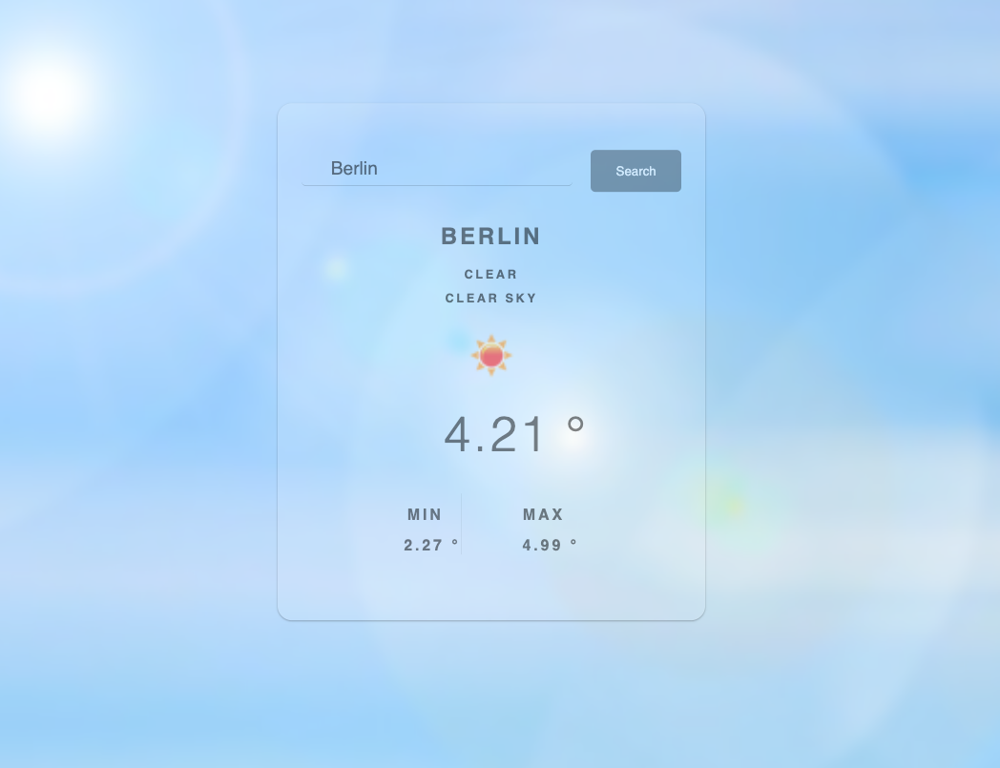

# Weather App

This is a simple weather application that fetches and displays weather information for a specified city using the OpenWeatherMap API.

## Features

- Fetches current weather data for a specified city
- Displays weather information including temperature, weather description, and weather icon
- Responsive design for different screen sizes

## Screenshots

## Demo Video

- [YouTube Demo](https://www.youtube.com/watch?v=axDwd5pUHU8)

- [Try it here] (https://moontags.github.io/Weather_App/)

## Technologies Used

- HTML
- CSS
- JavaScript
- OpenWeatherMap API

